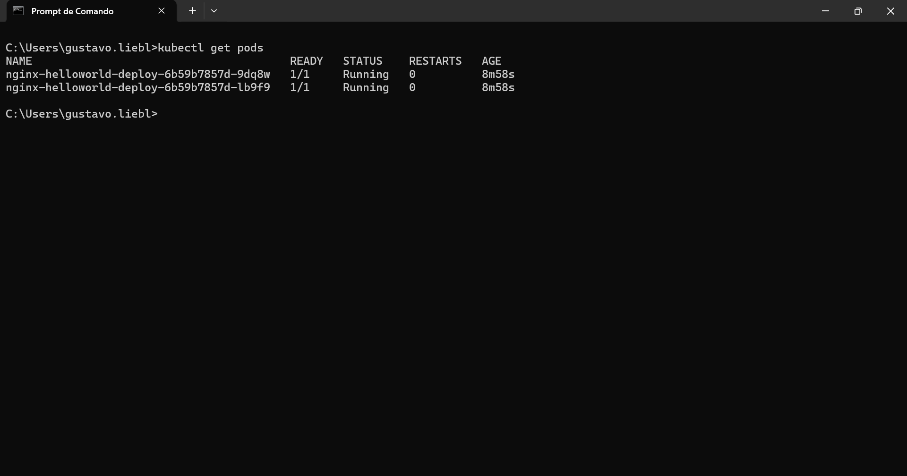
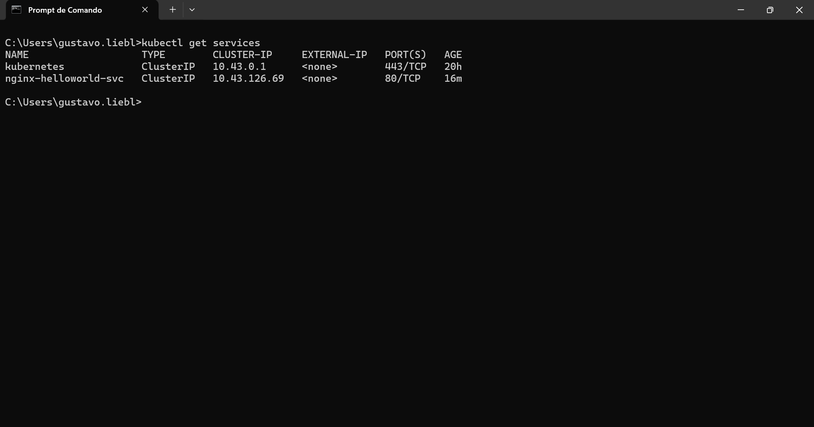
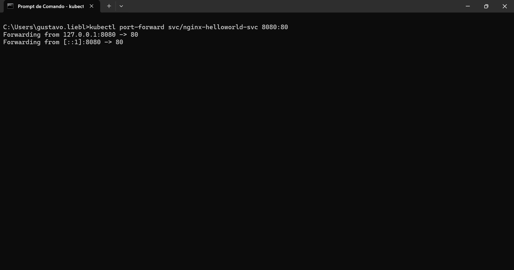
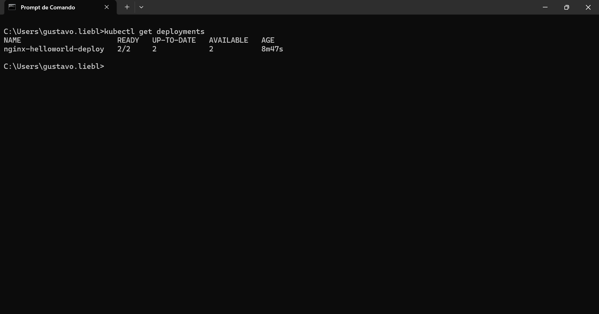
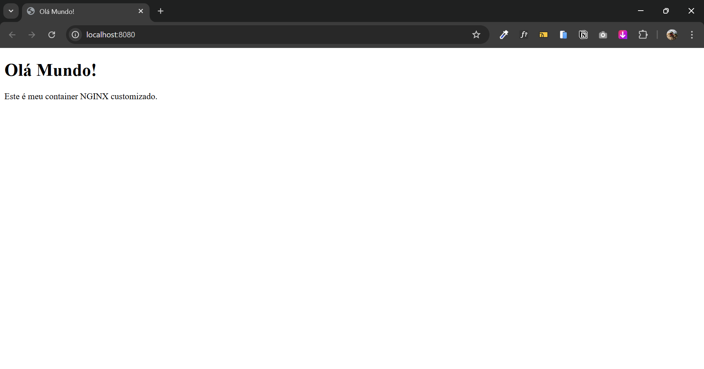

# nginx-helloworld

Este projeto demonstra como fazer o deploy de uma aplicação nginx simples em um cluster Kubernetes, incluindo configuração de serviços e port-forwarding para acesso local.

## Pré-requisitos

- Kubernetes cluster configurado
- kubectl instalado e configurado
- Docker (para build de imagens personalizadas, se necessário)

## Deploy da Aplicação

```bash
kubectl apply -f deployment.yaml
```
```bash
kubectl apply -f service.yaml
```
### 1. Verificando os Pods

Para verificar se os pods estão rodando:

```bash
kubectl get pods
```


*Pods nginx-helloworld em execução - Status Running com 1/1 containers prontos*


### 2. Verificando os Serviços

Para verificar os serviços criados no cluster:

```bash
kubectl get services
```


*Serviços do cluster - nginx-helloworld-svc configurado como ClusterIP*


### 3. Port-Forward para Acesso Local

Para acessar a aplicação localmente

```bash
kubectl port-forward svc/nginx-helloworld-svc 8080:80
```


*Port-forward configurado - Redirecionamento das portas 8080 -> 80*


### 4. Verificando os Deployments

Para verificar o status dos deployments:

```bash
kubectl get deployments
```


*Deployment nginx-helloworld-deploy com 2/2 réplicas disponíveis*


## 🌐 Acessando a Aplicação

Após configurar o port-forward, a aplicação estará disponível em:
- **URL**: http://localhost:8080



## 📁 Estrutura do Projeto

```
nginx-helloworld/
├── docs               # Prints
├── html               # HTML Customizado
├── Dockerfile         # Construir a imagem Docker
├── deployment.yaml    # Configuração do deployment
├── service.yaml       # Configuração do serviço
└── README.md          # Documentação
```

